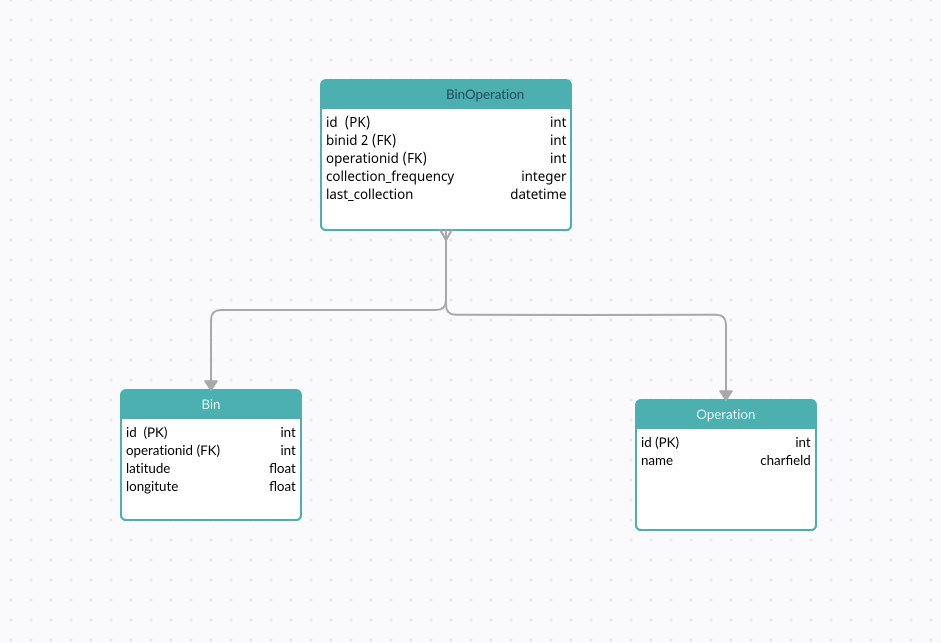

# For Run Project
``virtualenv myenv && source myenv/bin/activate ``

``pip install -r requirements.txt``

``python manage.py migrate``

``pyhton manage.py runserver``

# Q1. 

``I- go to '/task/collection_frequency'``

``II- By typing the trigger, an intermediate table can be created by keeping only the last data for each vehicle. Thus, the amount of data we will query is reduced.
``

#Q2. 
`` I- go to '/task/navigation_record'``

``II-  ``

